# Session Viewer

[](LICENSE)
[](https://www.python.org/)


Session Viewer turns the Claude Code and Codex transcripts already on your machine into a calm, searchable reading experience. Browse decisions, recover an implementation detail, compare approaches, and export the useful parts — all without uploading your conversations to a third party.

It is a small, dependency-free local web app. It reads transcript files in `~/.claude/projects` and `~/.codex/sessions`, then serves the viewer from `127.0.0.1`.

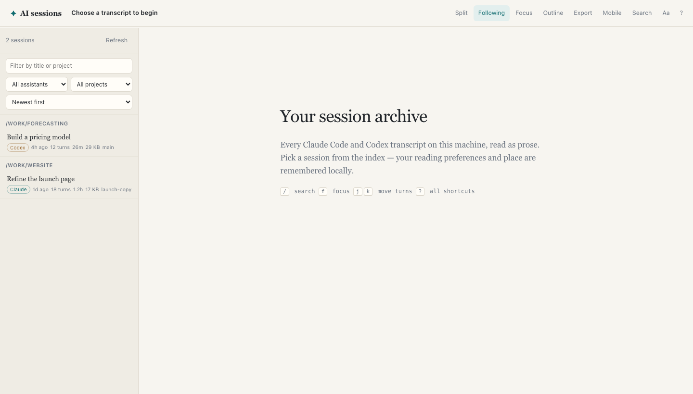

## Why it exists

AI coding sessions often contain the context behind a decision: alternatives considered, commands run, trade-offs made, and the exact wording that led to a solution. Terminal scrollback is not a useful archive. Session Viewer makes that history pleasant to revisit while leaving ownership and storage with you.

## Features

### Compare two sessions side by side

Use split view to place two transcripts next to one another. Each pane scrolls independently, which makes it easy to compare iterations, alternative plans, or work done in different assistants.

For example, open a Claude Code session and a Codex session that addressed the same bug, architecture decision, or research question. Compare their reasoning, tool use, recommendations, and final answers without losing either conversation’s context.

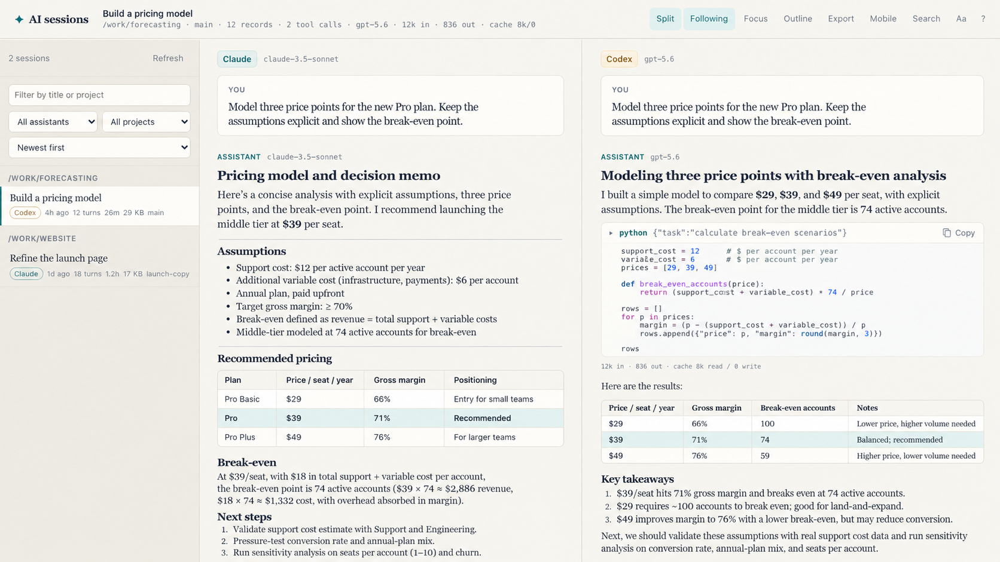

### Browse a local archive

Sessions are grouped by project and include source, recency, turn count, duration, and file size. Filter by title or project; limit to Claude or Codex; and sort by newest, oldest, longest, or largest.


### Keep the sessions worth returning to

Star a session, give it a clearer private title, add comma-separated tags, and leave a short note about why it matters. Saved details live only in your browser's local storage; filter the archive to starred or tagged work when you need it again.

### See the shape of a session

Open **Insights** for prompt, response, tool-call, and error-mention counts, plus a compact list of tools used and file paths detected in loaded tool inputs. It is computed locally from the transcript already in the reader.

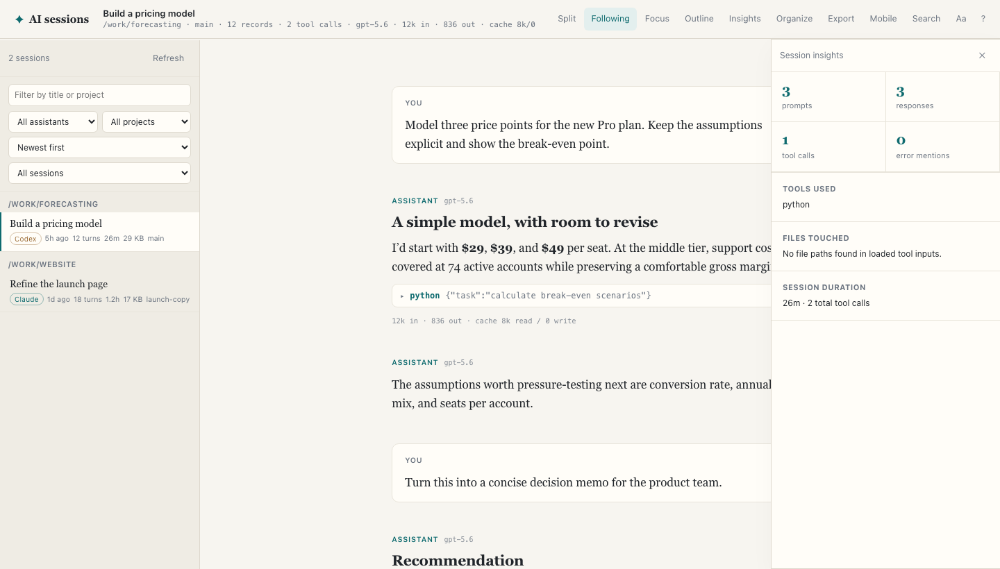

### Read conversations, not raw JSONL

Transcript turns lead with prose. Tool use appears in expandable cards, while system reminders and harness plumbing stay out of the way unless you explicitly enable them. Records belonging to one assistant response are kept together.

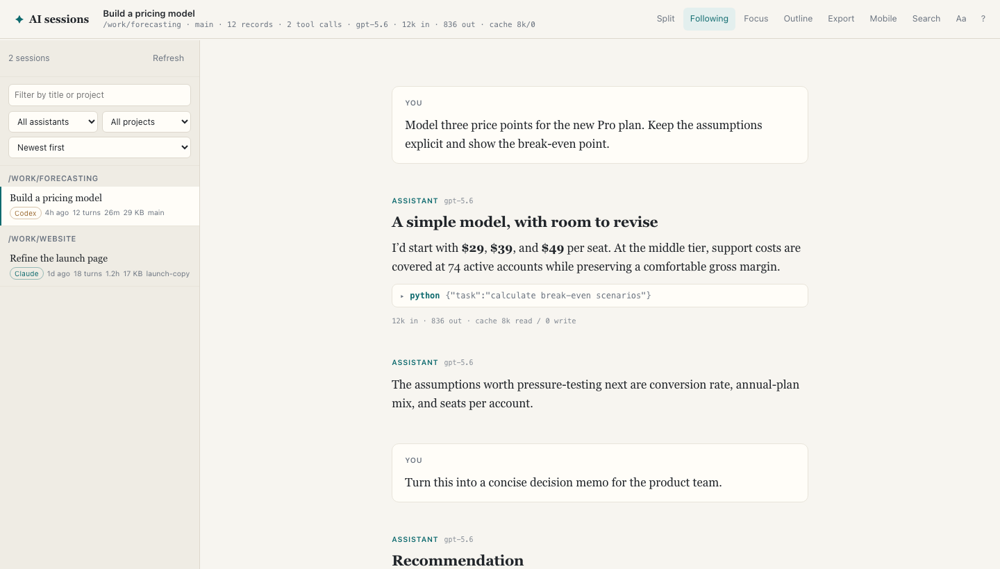

Live follow keeps an open transcript current while an agent is still writing it. Export creates a Markdown copy of the active session; both controls remain available in the transcript header.

### Search the whole archive

Search both sides of every transcript and jump straight to a matching record. Results are grouped by session, so a half-remembered phrase is enough to recover its original context.

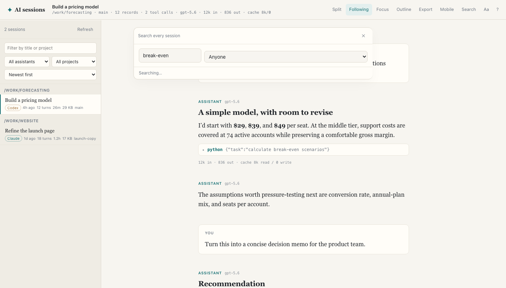

### Navigate by prompt, or inspect the source record

The outline follows the prompts in the open session and tracks your reading position. Select any turn or tool to inspect its normalized source JSON in the raw-record panel.

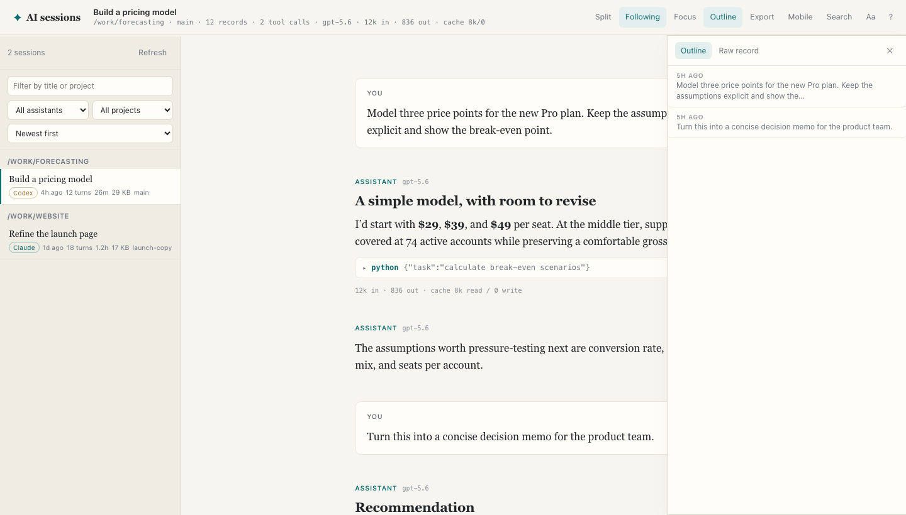

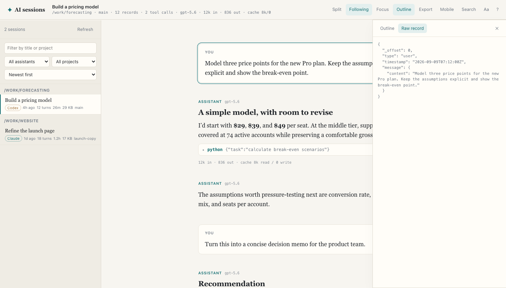

### Continue reading on a trusted network

The optional Mobile button starts a separate LAN listener only when requested, displays a QR code, and provides a per-run key. Stop sharing or quit the server to close it again. This is intentionally a trusted-network convenience — traffic is plain HTTP, not remote access.

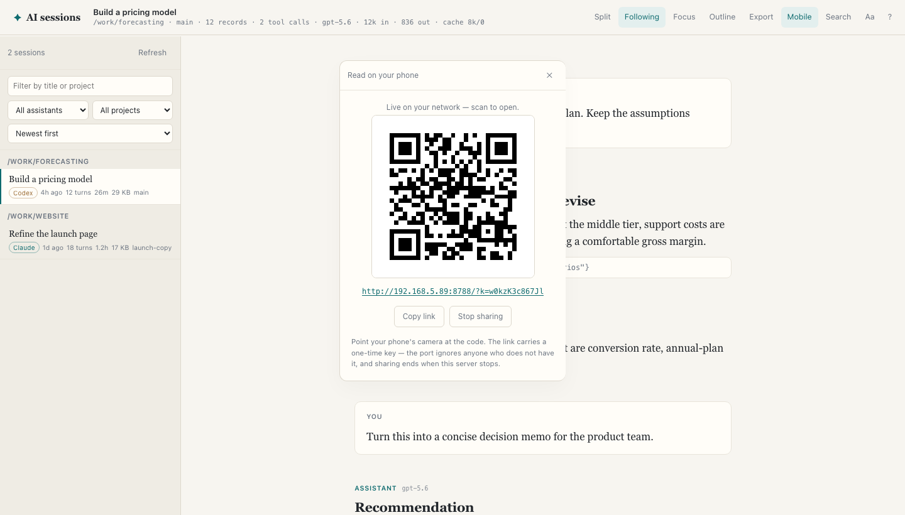

### Make long sessions comfortable

Tune font size, family, line width, leading, theme, density, tool detail, timestamps, and token accounting. Focus mode removes tools and bookkeeping entirely. Your reading position and preferences are saved in `localStorage`.

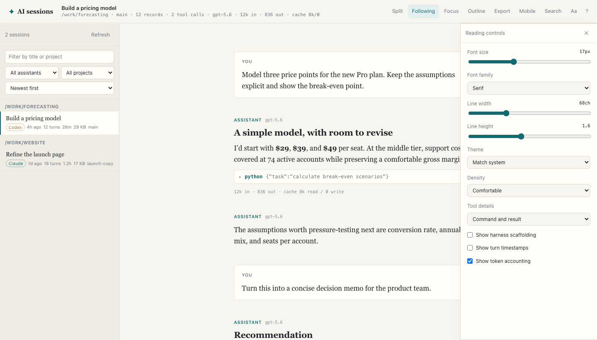

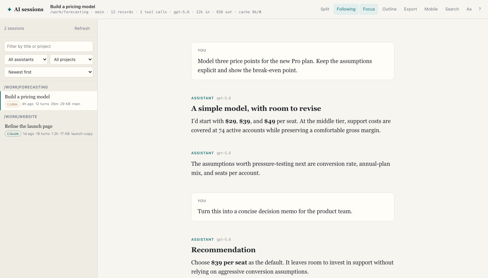

### Stay in the flow with keyboard shortcuts

Use `/` to search, `j` and `k` between turns, `f` for focus, `s` for split view, and `e` to export. Press `?` for the complete, in-app shortcut map.

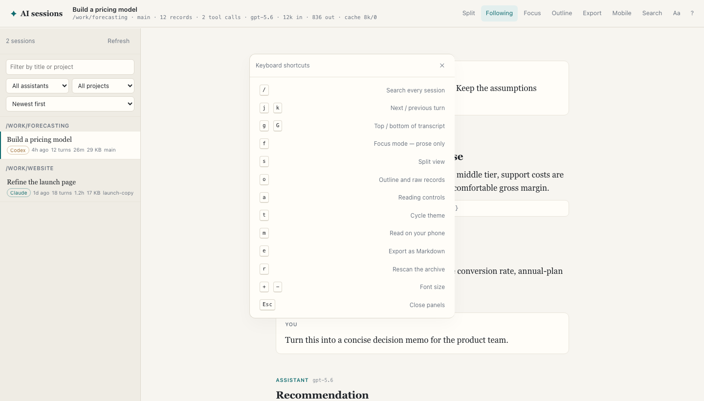

## Also included

- Incremental mtime-keyed index cache for quick repeat launches.
- A standalone stdlib QR encoder (`qr.py`); no packages required.

## Run it

```sh
python3 serve.py
```

Open [http://127.0.0.1:8787](http://127.0.0.1:8787). The first scan reads the transcript folders on this machine and writes a local index cache to `~/.cache/claude-session-viewer/index.json`.

To make phone reading available when the server starts:

```sh
python3 serve.py --lan
```

## Privacy and security model

The app makes no outbound requests, uses no accounts, collects no telemetry, and has no dependencies. Its regular server binds to loopback only.

When you enable phone sharing, it opens port `8788` on the local network with a random per-run key. Requests without that key receive `403`; a valid key is exchanged for a one-day cookie so the visible URL can be cleaned up. The shared listener cannot start or stop sharing itself. Because this is plain HTTP, use it only on a network you trust.

## Transcript sources

| Source | Location |
| --- | --- |
| Claude Code | `~/.claude/projects/**/*.jsonl` |
| Codex | `~/.codex/sessions/**/*.jsonl` |

The reader normalizes the two formats at the server boundary, so the interface works the same way for either source.

## API

| Endpoint | Purpose |
| --- | --- |
| `/api/index` | Session summaries; add `?refresh=1` to force a rescan |
| `/api/session` | A transcript page by `offset`, or the page before one |
| `/api/tail` | Records written after a byte offset |
| `/api/search` | Substring search across sessions |
| `/api/export` | Active session as Markdown |
| `/api/share` | Sharing state and QR data |

## Demo pages

The screenshot source pages are checked in under [`demo/`](demo/): `library.html`, `transcript.html`, `search.html`, `compare.html`, `mobile.html`, and `reading-controls.html`. They contain prefilled sample content and can be opened locally with any static server.

## Verification notes

The reader has been exercised against a local corpus of 557 sessions (234 Claude and 323 Codex), including incremental indexing, a 7.5 MB / 4,754-record transcript, live tailing, archive search, Markdown export, Markdown rendering, QR decoding, and LAN-key access controls.

There is not yet an automated test suite, cross-platform verification, a real-phone viewport test, or a long-running concurrent-write soak test. Contributions in those areas are especially welcome.

## License

[MIT](LICENSE)
